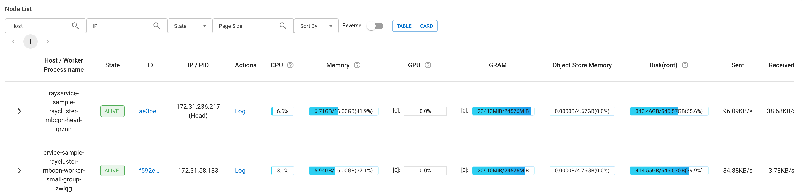

We'll introduce how to use Ray cluster to serve LLM with multiple instances and provide high-availability inference service. Here are two methods to run the distributed inference introduced [here](../../Performance/distributed-inference.md), here is the methond one.

Backgroud:

1. What's [Ray Serve](https://docs.ray.io/en/latest/serve/getting_started.html)

2. What's [vllm](https://docs.vllm.ai/en/latest/)

Verified environment:

* Ray 2.11.0
* vllm 0.4.1
* Python 3.10.12
* Two nodes with Nvidia 3090 on each one
* KubeRay v1.1.0 installed following [this guide](https://docs.ray.io/en/master/cluster/kubernetes/getting-started/raycluster-quick-start.html#kuberay-raycluster-quickstart)

## Deploy using Ray Serve

### Prepare base image with Ray installed on vllm
```Dockerfile
# Use vllm 0.4.1 and ray will be 2.11.0 for now
# python version is py3.10.12
FROM vllm/vllm-openai:v0.4.1

# wget for health check and ray for default packages
RUN apt-get install -y curl wget && pip install 'ray[default]' -i https://pypi.mirrors.ustc.edu.cn/simple/
```
Let's name it ```vllm/vllm-openai:ray-2.11.0-py3.10.12```.

### Prepare the image including the application

#### Test and prepare the package
1. Prepare the LLM script for inference serving and create a zip file containing the llm serving script, refer to [llm-serving-app](https://github.com/kubeagi/arcadia/tree/main/deploy/ray-serve-vllm/llm-serving-app) for a sample.
```shell
# For dev environment, you can run the script directly on Ray head node to test it
serve run --working-dir /vllm-workspace llm-serving:deployment

# Once it's tested, package it to a zip file that Ray Serve supports, and prepare to deploy to production environment
zip -r llm-serving-app.zip llm-serving-app
```

You can also use ```serve build``` and ```serve deploy``` to test the application
```shell
serve build llm-serving:deployment -o llm-serving-config.yaml
# Update the config.yaml as needed
serve deploy --working-dir /vllm-workspace -a http://<ray-address>/ llm-serving-config.yaml
# Check the deployemnt status
serve status -a http://<ray-address>/
```

2. Create the image
```Dockerfile
# the base image is built from previous Dockerfile.vllm.ray
FROM vllm/vllm-openai:ray-2.11.0-py3.10.12

# Copy the packaged python application to vllm-workspace
COPY llm-serving-app.zip /vllm-workspace/
```

Let's name it ```vllm/vllm-openai:ray-2.11.0-py3.10.12-llm-app```.

### Deploy using RayServe for production

Use [raycluster-serve-llm.yaml](https://github.com/kubeagi/arcadia/tree/main/deploy/ray-serve-vllm/) to deploy the application with Ray Serve.

```
# Run kubectl to apply it, it'll create resources under kuberay-system namespace
kubectl apply -f raycluster-serve-llm.yaml

# Check the status
kubectl get pod -n kuberay-system
```

You should get a similar result below:
```
$ kubectl get pods -n kuberay-system
NAME                                                      READY   STATUS    RESTARTS   AGE
ervice-sample-raycluster-mbcpn-worker-small-group-zwlqg   1/1     Running   0          2d6h
kuberay-operator-56fd8bff68-rwdrq                         1/1     Running   1          12d
rayservice-sample-raycluster-mbcpn-head-qrznn             1/1     Running   0          2d6h

$ kubectl get svc -n kuberay-system
kuberay-operator                              ClusterIP   10.105.121.59    <none>        8080/TCP                                        12d
rayservice-sample-head-svc                    ClusterIP   10.101.143.66    <none>        10001/TCP,8265/TCP,6379/TCP,8080/TCP,8000/TCP   2d6h
rayservice-sample-raycluster-mbcpn-head-svc   ClusterIP   10.110.104.169   <none>        10001/TCP,8265/TCP,6379/TCP,8080/TCP,8000/TCP   2d6h
rayservice-sample-serve-svc                   ClusterIP   10.106.63.56     <none>        8000/TCP                                        2d6h
```

### Visit the Ray dashboard and LLM service
Use the ClusterIP of ```rayservice-sample-head-svc``` service or expose it using Ingress to access the Ray dashboard, it'll show the status of cluster's status like below.


Use the ClusterIP of ```rayservice-sample-serve-svc``` service or expose it using Ingress to access the LLM service, and then test it using completions API.
```shell
curl http://raysvc.172.40.20.125.nip.io/v1/completions -H "Content-Type: application/json" -d '{ "model": "/data/models/qwen1.5-7b-chat", "prompt": "San Francisco is a", "temperature": 0, "stream": false}'
```

## Autoscale using Ray Serve
Refer to [Ray Serve Autoscaling](https://docs.ray.io/en/latest/serve/autoscaling-guide.html) and [Advanced Ray Serve Autoscaling](https://docs.ray.io/en/latest/serve/advanced-guides/advanced-autoscaling.html#serve-advanced-autoscaling) for some background.

1. Add autoscaling_config to the deployments of raycluster-serve-llm.yaml above, to enable auto scaling.
```yaml
  serveConfigV2: |
    applications:
      - name: llm-serving-app
        import_path: llm-serving:deployment
        route_prefix: /
        runtime_env:
          working_dir: FILE:///vllm-workspace/llm-app.zip
        deployments:
          - name: VLLMPredictDeployment
            max_ongoing_requests: 5 # Set max_ongoing_requests to ~20 to 50% higher than target_ongoing_requests
            autoscaling_config: # Add this to enable auto scaling
              target_ongoing_requests: 2 # Scales number of replicas for a deployment up or down based on the average number of ongoing requests per replica
              min_replicas: 0 # Minimum number of replicas for the deployment
              max_replicas: 5 # Maximum number of replicas for the deployment
```

min_replicas [default=1]: Set the min_replicas to 0, if there are periods of no traffic and the deployment will scale to zero to save cost. Note that setting min_replicas = 0 causes higher tail latencies; when you start sending traffic, the deployment scales up, and there will be a cold start time as Serve waits for replicas to be started to serve the request. So for LLM to start, it may take several seconds for cold start.

downscale_delay_s [default=600s]: This defines how long Serve waits before scaling down the number of replicas in your deployment. In other words, this parameter controls the frequency of downscale decisions. So the deployment will scale to 0 if min_replicas is 0 and no traffic after about 600s.

## Model Registry
TODO:
Similar as fastchat's controller and gradio server architecture, so we can have a single access point for multiple models deployed using Ray Serve. But for now, we'll have separate ingress for each model.

## Single Ingress URL
TODO: 
similiar as the Model Registry, should take into consideration together.

## Others
We can use Ray cluster to multiple types of services besides LLM, for example:

[Whisper Streaming with Ray Serve](https://github.com/aws-samples/ray-serve-whisper-streaming-on-eks/blob/main/README.md)

[Serve ML Models](https://docs.ray.io/en/latest/serve/tutorials/serve-ml-models.html)

[Serve a Stable Diffusion Model](https://docs.ray.io/en/latest/serve/tutorials/stable-diffusion.html)

[Serve a Text Classification Model](https://docs.ray.io/en/latest/serve/tutorials/text-classification.html)

[Serve an Object Detection Model](https://docs.ray.io/en/latest/serve/tutorials/object-detection.html)

